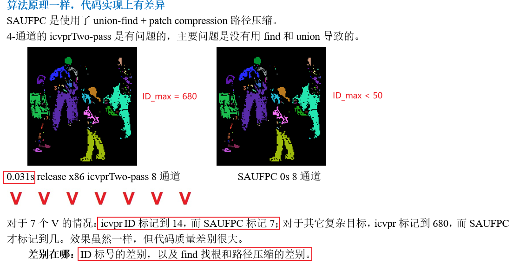

[TOC]

相机为**固定安装**的长波红外相机，分辨率为640×512和1280×1024，需要进行运动目标检测，用**红色矩形框将运动目标框出来**。

- **设备部署环境**：用于周界安防、边海防、无人机探测。一般用于远距离监控，200m~1km，场景中目标较稀疏。
- **软件部署环境**：windows exe (C++ QT)
- **时间效率**：旋转一圈为2s，图像拼接，界面显示，以及算法处理时间开销在2s内完成。2s刷新一次全景帧显示。

- **周界安防**：行人和车辆等动目标检测预警。主要解决以下问题：

  1. 树木晃动

  2. 大型船只检测，多框
  3. 重叠框合并
  4. 行人分类
  5. 多目标轨迹

- **实现其他应用**：

  - 双目测距

- **海防海浪虚警**：

  ①小目标被淹没在海浪虚警中 ②低对比度的物体漏检 ③大型船只(pixel×pixel)检测分割为多个框

## 0. 算法流程

固定安装模式下

- **目标检测**：基于背景建模的运动目标检测

- **得到目标框**：前景标记 → 逻辑筛除 → 合并重叠框 → 界面显示

- **对目标框ROI进行分类**

- **多目标轨迹**

  

  

  

## 1. 树木晃动问题

## 2. 大型目标多个检测框

出现这个问题有两个原因：

- ① 背景建模算法的背景模型更新太快，目标2帧停留其像素点就融入背景模型，但船只移动速度较慢，停留超过2帧。距离较远的船只缓慢移动时甚至船身重叠10+ 。下图红色部分所示，船头一直是入侵的新目标，而船身已经融入背景，无法检测 。
- ② 对前景标记时采用 **均值漂移聚类**，漂移半径固定，对于大型船只，小的漂移半径导致多框。
  - 漂移半径小，适合行人和车辆这种小型目标。**当人和车辆**由于部分遮挡、部分伪装色等原因，**前景呈现空洞、不完整时**，漂移半径能够将近邻的离散前景像素聚类在一起，形成一个完整的红色检测框。**但小的漂移半径对于大型船只就会导致多个框**
  - 漂移半径大，虽然可以将船只的框聚类在一起，但对于远处小目标而言，本应分离的两个目标被聚类在一起。**风险大于收益**

  

解决办法：① 针对第一个，在船只场景中，增加前景停留。

- **好处：**缓慢运动物体前景空洞减少
- **风险：**运动变静止、静止变运动的初始残留『**鬼影** 』会延长

② 针对第二个问题，对于大型船只而言，没有利用连通性的性质。在前景标记中，**连通域标记Connected component labeling** CCL和 **均值漂移聚类标记** 二者各有优劣，优势互补。

- 『**CCL**』可以将连通的前景标记为一个ID，但前景稍有分离（如目标被割裂为多个）即被标记为2个目标ID
- 『**均值漂移聚类**』，可以将分离的部分聚类为一个（无差别标记），但大型船只前景来连通却标记为多个目标

==解决办法：CCL + 中心近邻框合并 + 重叠框合并==

### 2.1 **连通域标记 Connected component labeling** 

- 连接组件标记（CCL），连接组件分析（CCA），blob提取，区域标记，blob发现或区域提取是**图论的一种算法应用**

- 有一个连通域标记的benchmark：https://github.com/prittt/YACCLAB
  - YACCLAB数据集包括合成图像和真实图像，并且适用于从文档处理到监视的广泛应用，并且在分辨率resolution，图像密度density，密度变化和组件数量component numbers方面具有显著差异，用于测试算法性能。

- 选择了Two-pass CCL 算法

  - https://blog.csdn.net/icvpr/article/details/10259577 4-通道 连通域标记；但存在问题：

    - ① 4通道自身的局限性：

      x|1|x

      1|1|1

      x|x|x

    - ② 代码bug：Union-Find的时候，根节点没有连接。导致2和27没连接在一起。因此出现了右侧的粉色部分

    

    

    

  - SAUF算法 8-通道，代码分析。**在连通域中，判断的顺序也很重要**

    - ① 只考虑一半通道，← ↖↑↗，即4个位置。4个位置，每个位置2中可能0/1，排列组合有16中，但筛掉重复情况扣，只剩如下7中情况。判断顺序和逻辑如下图所示。

    - ② SAUF使用了UnionFind+Path compression 并查集+路径压缩 QuickUnion+PC **SAUF使用了路径压缩，时间效率较高**

      对N个节点进行M次union操作，QuickUnion、Weighted QuickUnion、Weighted QuickUnion+PC 时间复杂度如下：

      - QuickUnion为  MN
      - Weighted QuickUnion N + MlogN
      - Weighted QuickUnion + PC  $N + Mlog*N $ , 其中$log*N ≤ 5   $

  

  

## 3. 重叠框合并

参考：[合并重叠框的算法逻辑](./合并重叠框的算法逻辑.md)

- ① 原始思路：数据结构使用`vector<cv::Rect> ` vector是一种顺序容器，采用动态数组实现。

  连续push时，采用溢出时倍增，push效率均摊下来$O(3N)$。删除时 size < 1/4容量时，resize为1/2容量。总是在$[1/4full, full]$之间

  但是在随机删除时，需要内存搬运。erase(ID)，需要将[ID+1, end)搬运到[D, end-1)。

- ② 大框吃小框-vector 动态数组 实现

- ③  大框吃小框-forward_list链表实现

结果分析：❶ **vector 动态数组** 比 **forward_list链表** 二者效果一致，但前者更快。

​				❷ 虽然动态数组在随机删除上耗时，但是内存是连续的搬运。理论上链表在随机删除上更占优势，且是在遍历过程中边遍历边删除，但是链表的内存不连续，需要寻址计算，时间消耗反而比前者更多。且链表比动态数组占用的内存更多。

另：不清楚是否有时钟抖动等影响！

## 4. 行人分类

特征提取：HOG  分类器：SVM

- HOG和SVM原理，线性分类器，SMO；liblinear的
  - 几何间隔，|w|化为|w|^2，变为l2正则化。
  - hinge loss 合页loss。
  - 对偶问题。
- mnist和cifar10的SVM分类，tSNE可视化。三层简单网络

在自己的数据集上遇到的问题：

- ① 多尺度问题

- ② 背景复杂

- ③ 对比度不统一

- ④ 负样本混淆

  这些问题如何处理和应对？什么原因？怎么处理？

## 5. 多目标轨迹

Kalman Filter + 匈牙利算法

- Sort与Deep Sort原理探查

## 6. YOLO检测问题

# （二）其它方面的准备

## ① 《算法4》+ leetcode

结合《算法4》的大作业等资料，结合leetcode，结合笔记和文档，把数据结构和算法吃透！进度如下：

- [x] ① Union Find 并查集
- [ ] ② Stack & Queue 栈和对列
- [ ] ③ Sort：Selection、Insertion、ShellSort、MergeSort、QuickSort、选择排序、插入排序、希尔排序、归并排序、快速排序

### leetcode 题解和参考

- https://github.com/MisterBooo/LeetCodeAnimation 
- https://github.com/azl397985856/leetcode

资源记录：比较好的leetcode 刷题路线和题解思路，打印+整理归纳

- https://blog.csdn.net/fuxuemingzhu/article/details/105183554 leetcode该怎么刷？
- 入门篇-:one:刷题姿势
  - **①对于新人而言，不应该自己死抠一个题目，如果想了一会没有任何思路，就应该果断看别人怎么写的。在理解了别人的做法之后，再凭理解和记忆在 LeetCode 的代码框里敲一遍。**
  - **学习 = 学 + 习**。知识是学出来的，不是在自己脑子里蹦出来的；学过之后，还要自己动手练习。新手要勇敢地、经常地学习别人的解法和答案，然后凭理解敲代码练习。只要度过刷题初期的痛苦，后面就会越刷越快。
- :two:基础知识：**《算法4》**这个书不用全部细看，可以只看重点。Java知识不用看，数学推导部分不用看。
  - **《STL源码剖析》**对理解C++ STL有很大帮助，看完后绝对会对数据结构和算法有更深的理解。看完之后相见恨晚。
- :three: 刷题顺序，合理的刷题顺序能够降低难度，帮助在有限的时间获得最快的成长。面试前刷200+足够了，600+以上更好。
- :four:看别人的题解：思路；​
  - 看别人的总结：算法讲解、套路整理、刷题模板。
  - 算法题 = 思路 + 模板。思路看别人的解答和讲解获得，模板就是做题的套路。
- :five:做好笔记。任何题，无论难度，我都记录题目、想法、代码。虽然经常写博客的时间比写题的时间还多，但是把自己的想法讲解一遍才是真的懂了，更方便了自己之后看、以及大家交流。经常看到自己几年前写的愚蠢代码，然后感叹自己确实有进步了。

https://www.cnblogs.com/grandyang/p/4606334.html Grandyang

- 刷题顺序：https://leetcode-solution-leetcode-pp.gitbook.io/leetcode-solution/thinkings/basic-data-structure#xian-xing-jie-gou 

  ① 线性结构：数组、队列、栈、链表；

  ② 非线性结构：树、二叉树、二叉平衡树、字典树

  ③ 图：基本概念；图的建立；图的遍历；常见算法

  

## ② Yolo系列问题解决思路

