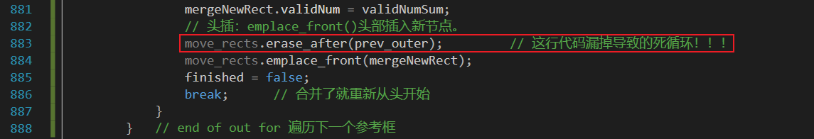
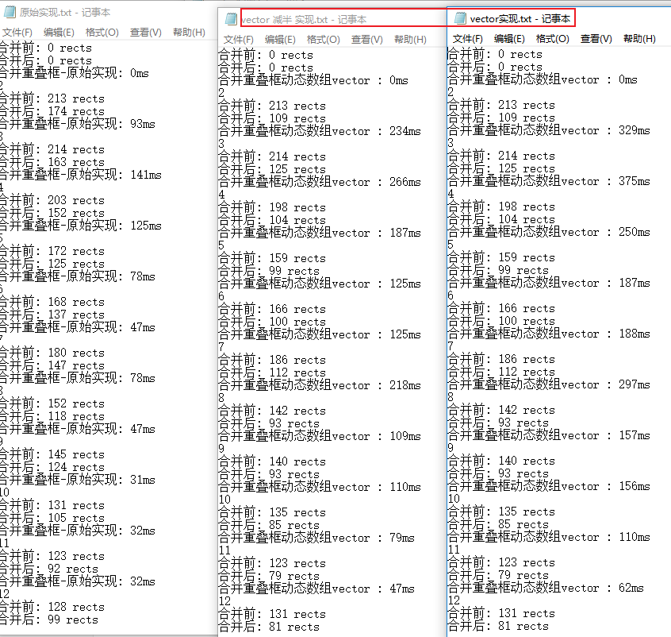
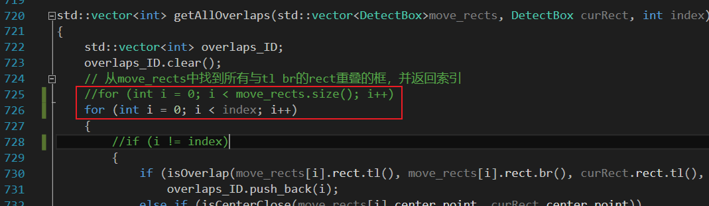
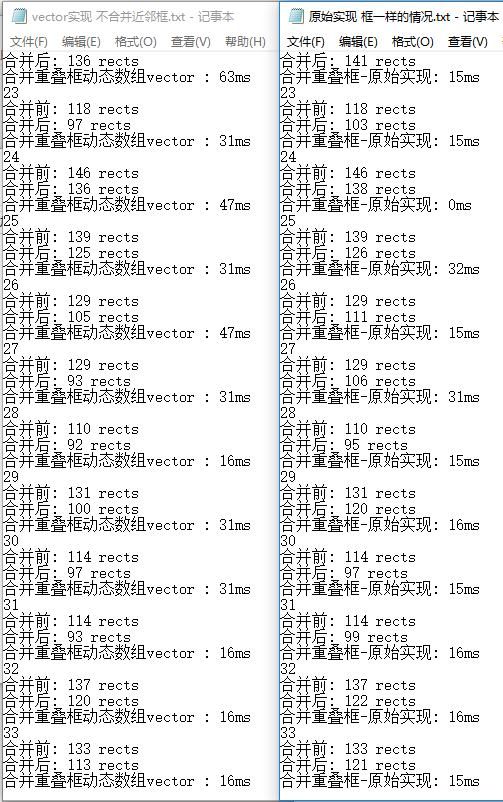

# MergeRectangle

C++见代码仓库：https://github.com/HaronCHou/MergeRectangle

参考资料：https://stackoverflow.com/questions/66490374/how-to-merge-nearby-bounding-boxes-opencv

方框如下图所示，期望将小框合并得到下图。


待合并的框（上图），期望得到的结果（下图）


# 1. 合并重叠框——遍历

代码总体框架如下：

有以下几点问题：**需要重叠框个数 × ( O(N2/2) + 2O(N) + 擦除 )**

① 只要有重叠框，就要进行一次合并O(N^2/2)遍历，去找重叠框。

② 删除时调用两次find 2*O(N)，调用一次擦除erase 复制和搬运！

```C++
is_continue = true;
do											// ( O(N^2/2) + 2*O(N) + 内存搬移 ) * 重叠框个数
{	// N^2复杂度，每次都要许多重复计算
    is_continue = intetsect(rects, s, t);	// O(N^2/2)
	if (is_continue == true)
		{
			Merge(rects, s, t);			// 两个find，2次遍历——2*O(N) + 内存搬移 erase擦除 复杂度高，复制和搬运
		}    
}while(is_continue)

bool intetsect(rects, s, t)
{
    for(i = 0; i < num; ++i)
        for(j = i + 1; j < num; ++j)
            if(isOverlap(rects[i], rects[j]))
            {
                s = i; t = j;
                return true;			// 只要遇到第一个overlap，就返回true
            }
    return false;
}
Merge(std::vector<cv::Rect>& rects, const int&s, const int&t)	// ID没有保存下来，两次查找重复计算
{
    // 使用查找算法，去寻找另一个框的ID
    auto pos = std::find(rects.begin(), rects.end(), rects[t]);
    // 将合并后的框给 pos->x, pos->y, pos->width, pos->height
    pos->x = x;    pos->y = y;    pos->width = w;    pos->height = h;
    //删除其中另一个
	auto pos = std::find(rects.begin(), pos, rects[s]);
	if (pos != rects.end())	rects.erase(pos);
}
```

## 1.1 std::find()函数复杂度

https://blog.csdn.net/zhangweijiqn/article/details/9107571 Rects是std::vector容器类型，find是在vector中进行查找。

vector本身是没有find这一方法，其find是依靠algorithm来实现的。记着要包含algorithm这一头文件，其定义了find这一函数。

**stl包括容器、迭代器和算法**：https://blog.csdn.net/huangyimin/article/details/6133650

1. **容器** 用于管理一些相关的数据类型。每种容器都有它的优缺点，不同的容器反映出程序设计的不同需求。**容器自身可能由数组或链表实现**，或者容器中的每个元素都有特殊的关键值。

2. **迭代器** 用于遍历一个数据集中的每个元素。这些数据集可能是容器或者容器的子集。

   ① 迭代器的==主要优点==是它们为任意类型的容器提供一个**小巧并且通用**(注意通用很重要)的接口。例如，迭代器接口的一个操作是让它依次遍历数据集的每个元素。这个操作是依赖容器的内总部结构独立完成的。迭代器之所以有效是因为容器类提供它自己的迭代器类型来做“正确的事”，容器本身的迭代器了解容器的内部结构。②迭代器的接口几乎相当于普通的指针。让一个迭代器递增只需调用＋＋操作符。使用*操作符可以得到迭代器引用的数据值。因而迭代器可以被任为是一种智能指针。

3. **算法** 被用于处理数据集中的元素。例如它们可以**搜索、排序、修改数据**或者其他目的。算法使用迭代器，因此，一个算法只需被编写一次就可以用于任意的容器，因为迭代器的接口对所有类型的容器是通用的。这就是find()的位置

   为了给算法更多的扩展性，需要提供一些被算法调用的附属函数。可以使用通用算法去适应非常特别和复杂的需求。你可以提供自己的搜索标准或者特殊的操作去绑定元素。
   
4. STL的概念是将**数据和操作**独立开来。数据由容器类管理，而操作是由可配置的算法定义。**迭代器则是这两个元素之间的线索**。它允许任何算法和容器的交互。

5. 在某种意义上，STL的概念有勃于面向对象编程的初衷：STL将数据和算法分离而不是将数据和算法捆绑在一起。
   然而，这样做的理由非常重要：原则上，你可以将任何容器同任何算法绑定，得到的结果是STL是**非常可扩展**的。

   STL的一个标准是**它支持任意数据类型**。“标准模板库”意味着，所有部分是适应任意类型的模板。STL是通用编程的例子。容器和算法对任意类型和类都是通用的。STL甚至提供更多的通用组件。使用 适配器 和函数体，你可以为特定需要补充、限制和配置算法和接口。

```C++
#include <iostream>
#include <algorithm>
#include <vector>
 
int main()
{
    using namespace std; 
    vector<int> vec;
 
    vec.push_back(1);vec.push_back(2);vec.push_back(3);vec.push_back(4); vec.push_back(5);vec.push_back(6);
 	// vector<int> 泛型 容器里面的类型是int，容器有迭代器iterator，提供对元素的遍历
    vector<int>::iterator it = find(vec.begin(), vec.end(), 6);
 
    if (it != vec.end())
        cout<<*it<<endl;
    else
        cout<<"can not find"<<endl;
     return 0;
}
```
https://blog.csdn.net/chenhanzhun/article/details/39698785 std::find()源码剖析  **STL源码剖析——STL算法之find查找算法**

所以std::vector 的 std::find() 算法就是遍历，又跑了2次for循环 O(2N) 
如果没找到，返回end的指针。若返回了end，表明没找到。

```C++
// find and find_if.
// 查找区间[first,last)内元素第一个与value值相等的元素，并返回其位置
// 其中find函数是采用默认的equality操作operator==
// find_if是采用用户自行指定的操作pred
 
// 若find函数萃取出来的迭代器类型为输入迭代器input_iterator_tag，则调用此函数
template <class _InputIter, class _Tp>
inline _InputIter find(_InputIter __first, _InputIter __last,
                       const _Tp& __val,
                       input_iterator_tag)
{// 若尚未到达区间的尾端，且未找到匹配的值，则继续查找
  while (__first != __last && !(*__first == __val))
    ++__first;
  // 若找到匹配的值，则返回该位置
  // 若找不到，即到达区间尾端，此时first=last，则返回first
  return __first;
}
// 若find_if函数萃取出来的迭代器类型为输入迭代器input_iterator_tag，则调用此函数
template <class _InputIter, class _Predicate>
inline _InputIter find_if(_InputIter __first, _InputIter __last,
                          _Predicate __pred,
                          input_iterator_tag)
{// 若尚未到达区间的尾端，且未找到匹配的值，则继续查找
  while (__first != __last && !__pred(*__first))
    ++__first;
  // 若找到匹配的值，则返回该位置
  // 若找不到，即到达区间尾端，此时first=last，则返回first
  return __first;
```

## 1.2 std::erase()复杂度

https://blog.csdn.net/TINA_DD/article/details/111937139 

erase实现：先将要删除的元素后面的内容复制到前面，然后再删除要删除的元素，相当于将元素提前。

https://blog.csdn.net/dalong277/article/details/52383749 有详细的分析，就是**内存搬运**

总结：删除操作传入迭代器，而迭代器所指向的位置在删除前后是不发生改变的，改变的只是容器中的元素值，**删除相应元素后，被删元素后面的所有元素复制到被删除元素的位置上去**，同时指向容器尾部的迭代器也移动到新的尾部位置。

```C++
//清除[first,last)中的所有元素
iterator erase(iterator first,iterator last){
    iterator i = copy(last,finish,first); //将区间[last,finish)内容复制到区间[first,first+finish-last) 
    destroy(i,finish) ;//释放[i,finish)区间内存
    finish = finish-(last-finish);
    return first; //迭代器位置没变，变得是内容
}
 
//清除某个位置上的元素
iterator erase(iterator position){
    if(position + 1 != end()){
        copy(position+1,finish,position);		// 关键在这个参数怎么实现？
}
    --finish;
    destroy(finish);
    return position; 
}

template
typename vector::iterator
vector::
_M_erase(iterator __position)
{
    if (__position + 1 != end())
    std::copy(__position + 1, end(), __position);
    –this->_M_impl._M_finish;
    return __position;
}
```

# 2. 合并重叠框


- 读入图像，Canny提取边缘。→ Contours找到边缘 → 从边缘计算boxes

- 只有index == len(boxes) && overlaps.size() ==0才能停止所有迭代，即遍历过所有的indx，都没有找到重叠，迭代停止。

  O(N^2/2)迭代终止。

- 每次处理完所有的重叠后，直接break，索引又从0开始的。

① 与之前相比，也是只要有重叠就要重新遍历！**没变**

② Overlap是**一次遍历中找到所有重叠**的，合并和删除时从后往前删除。**但是删除的操作还是erase复制和搬运**

③ 只是O(N2/2)遍历次数少了一些，删除时搬运内存太多了。

 编辑：这种低效率让我有点困扰。**盒子被合并的顺序并没有真正的意义**。你可以看到有很多步骤，小盒子合并成一个大盒子，而不是一个大盒子吃掉它里面的所有东西并成长。事实证明这是一个非常简单的代码修复。**由于新合并的框被附加到框列表的末尾**，我们可以反向索引以使其从大到小。

```C++
while(finished == false)
{
    finished = true;

    index = 0;
    while (index < len(boxes))
    {   // 遍历一遍boxes O(N)，记录所有重叠的索引
        overlaps.push_back(index);
        DetectBox curRect = move_rects[index];
        std::vector<int> overlaps = getAllOverlaps(move_rects, curRect, index); // O(N)
        cv::Rect mergeRect = cv::boundingRect(points);					// 合并后的大框
        if (overlaps.size() > 0)              							// 有重叠就合并
        {
            // 删除合并前的所有小框：逆向排序，再删除，效率较高
            std::sort(overlaps.begin(), overlaps.end(), cmp1);			// 排序，小数组逆序排序
            for (int i = 0; i < overlaps.size(); i++)					// erase擦除还是复制
				{ // 排序后擦除，从后往前擦除复制的就要少一些 数据结构vector是动态数组的。
					vector<DetectBox>::iterator   iter = move_rects.begin() + overlaps[i];
					move_rects.erase(iter);		// 这个地方的erase太高了，还可以再降低一些，使用双指针删除
				}
				move_rects.push_back(mergeNewRect);
            finished = false;
            break;
        }
        index += 1;
    }
}
```

优化为如下：

```C++
while(finished == false)
{
    finished = true;

    index = boxes.size() - 1;											// 就这里改变一下，变为大框吃小框
    while (index > 0)
    {   // 遍历一遍boxes O(N)，记录所有重叠的索引
        overlaps.push_back(index);
        DetectBox curRect = move_rects[index];
        std::vector<int> overlaps = getAllOverlaps(move_rects, curRect, index); // O(N)
        cv::Rect mergeRect = cv::boundingRect(points);					// 合并后的大框
        if (overlaps.size() > 0)              							// 有重叠就合并
        {
            // 删除合并前的所有小框：逆向排序，再删除，效率较高
            std::sort(overlaps.begin(), overlaps.end(), cmp1);			// 排序，小数组逆序排序
            for (int i = 0; i < overlaps.size(); i++)					// erase擦除还是复制
				{ // 排序后擦除，从后往前擦除复制的就要少一些 数据结构vector是动态数组的。
					vector<DetectBox>::iterator   iter = move_rects.begin() + overlaps[i];
					move_rects.erase(iter);		// 这个地方的erase太高了，还可以再降低一些，使用双指针删除
				}
				move_rects.push_back(mergeNewRect);
            finished = false;
            break;
        }
        index += 1;
    }
}
```


大框吃小框的方式，确实是快了10倍。

```python
import cv2
import numpy as np

# tuplify
def tup(point):
    return (point[0], point[1]);

# returns true if the two boxes overlap
def overlap(source, target):
    # unpack points
    tl1, br1 = source;
    tl2, br2 = target;

    # checks
    if (tl1[0] >= br2[0] or tl2[0] >= br1[0]):
        return False;
    if (tl1[1] >= br2[1] or tl2[1] >= br1[1]):
        return False;
    return True;

# returns all overlapping boxes
def getAllOverlaps(boxes, bounds, index):
    overlaps = [];
    for a in range(len(boxes)):
        if a != index:
            if overlap(bounds, boxes[a]):
                overlaps.append(a);
    return overlaps;

img = cv2.imread("test.png")
orig = np.copy(img);
blue, green, red = cv2.split(img)

def medianCanny(img, thresh1, thresh2):
    median = np.median(img)
    img = cv2.Canny(img, int(thresh1 * median), int(thresh2 * median))
    return img

blue_edges = medianCanny(blue, 0, 1)
green_edges = medianCanny(green, 0, 1)
red_edges = medianCanny(red, 0, 1)

edges = blue_edges | green_edges | red_edges

# I'm using OpenCV 3.4. This returns (contours, hierarchy) in OpenCV 2 and 4
_, contours,hierarchy = cv2.findContours(edges, cv2.RETR_EXTERNAL ,cv2.CHAIN_APPROX_SIMPLE)

# go through the contours and save the box edges
boxes = []; # each element is [[top-left], [bottom-right]];
hierarchy = hierarchy[0]
for component in zip(contours, hierarchy):
    currentContour = component[0]
    currentHierarchy = component[1]
    x,y,w,h = cv2.boundingRect(currentContour)
    if currentHierarchy[3] < 0:
        cv2.rectangle(img,(x,y),(x+w,y+h),(0,255,0),1)
        boxes.append([[x,y], [x+w, y+h]]);

# filter out excessively large boxes
filtered = [];
max_area = 30000;
for box in boxes:
    w = box[1][0] - box[0][0];
    h = box[1][1] - box[0][1];
    if w*h < max_area:
        filtered.append(box);
boxes = filtered;

# go through the boxes and start merging
merge_margin = 20;	# 重叠的像素

# this is gonna take a long time
finished = False;
highlight = [[0,0], [1,1]];
points = [[[0,0]]];
while not finished:
    # set end con
    finished = True;

    # check progress
    print("Len Boxes: " + str(len(boxes)));

    # draw boxes # comment this section out to run faster
    copy = np.copy(orig);
    for box in boxes:		# 用绿色表示小框，蓝色高亮表示合并的大框
        cv2.rectangle(copy, tup(box[0]), tup(box[1]), (0,200,0), 1);
    cv2.rectangle(copy, tup(highlight[0]), tup(highlight[1]), (0,0,255), 2);
    for point in points:
        point = point[0];
        cv2.circle(copy, tup(point), 4, (255,0,0), -1);
    cv2.imshow("Copy", copy);
    key = cv2.waitKey(1);
    if key == ord('q'):
        break;

    # loop through boxes
    index = 0;
    while index < len(boxes): # 从id[0]的小框遍历起
        # grab current box
        curr = boxes[index];

        # add margin
        tl = curr[0][:];
        br = curr[1][:];
        tl[0] -= merge_margin;
        tl[1] -= merge_margin;
        br[0] += merge_margin;
        br[1] += merge_margin;

        # get matching boxes 遍历一遍所有框，找到冲得狂的索引放进overlaps
        overlaps = getAllOverlaps(boxes, [tl, br], index);
        
        # check if empty
        if len(overlaps) > 0:
            # combine boxes
            # convert to a contour
            con = [];
            overlaps.append(index);
            for ind in overlaps:
                tl, br = boxes[ind];
                con.append([tl]);
                con.append([br]);
            con = np.array(con);

            # get bounding rect
            x,y,w,h = cv2.boundingRect(con);

            # stop growing
            w -= 1;
            h -= 1;
            merged = [[x,y], [x+w, y+h]];

            # highlights
            highlight = merged[:];
            points = con;

            # remove boxes from list
            overlaps.sort(reverse = True);
            for ind in overlaps:
                del boxes[ind];
            boxes.append(merged);

            # set flag
            finished = False;
            break;

        # increment
        index += 1;
cv2.destroyAllWindows();

# show final
copy = np.copy(orig);
for box in boxes:
    cv2.rectangle(copy, tup(box[0]), tup(box[1]), (0,200,0), 1);
cv2.imshow("Final", copy);
cv2.waitKey(0);
```

最后实现的代码：C++如下

```C++
fg /= 255;
cv::Mat labels, stats, centroids;
// CCL计算Labels，centroids为中心点
int nccomps = cv::connectedComponentsWithStats(fg, labels, stats, centroids, 8, 4, cv::CCL_WU);
int all_mvpoints = 0;
// 从CCL获取信息
std::vector<DetectBox> move_rects = getMoveRects(nccomps, stats, centroids, all_mvpoints);
// 筛选前景目标点数 适用于抖动场景
if (all_mvpoints >= points_limit)		move_rects.clear();	
// 框过多 
//if (move_rects.size() >= obj_limit)		move_rects.clear();
Merge(move_rects);		 // 加速版的Merge
gau_rects.clear();		// 结构切换
for (int i = 0; i < move_rects.size(); i++)
{
    cv::Rect roi = move_rects[i].rect;
    roi.x += m_rect.x;
    roi.y += m_rect.y;
    gau_rects.push_back(roi);
}
```

```C++
/* int nccomps, cv::Mat stats, cv::Mat centroids */
std::vector<DetectBox> BoatDetect::getMoveRects(int nccomps, cv::Mat stats, cv::Mat centroids, int &all_mvpoints)
{
	std::vector<DetectBox> move_rects;
	std::vector<cv::Point2f> center_points;
	all_mvpoints = 0;
	for (int id = 1; id < nccomps; id++)
	{
		int xmin = stats.at<int>(id, 0);	// max_ID * 5 的矩阵
		int ymin = stats.at<int>(id, 1);
		int width = stats.at<int>(id, 2);
		int height = stats.at<int>(id, 3);
		int validNum = stats.at<int>(id, 4);
		all_mvpoints += validNum;
		// 筛选部分：高度、宽度、面积、点数；长宽比等
		if (width < 10 || height < 10) continue;
		if (validNum <= limit_num ) continue;

		DetectBox tmp;
		tmp.rect = cv::Rect(xmin, ymin, width, height);
		tmp.validNum = validNum;
		// 对应的质心位置
		float cenx = centroids.at<double>(id, 0);
		float ceny = centroids.at<double>(id, 1);
		tmp.center_point = cv::Point2f(cenx, ceny);
		move_rects.push_back(tmp);
	}
	return move_rects;
}
// 用于逆排序
int cmp1(int a, int b)
{
	return b < a;
}
/* 合并重叠框和近邻框 */
void BoatDetect::Merge(std::vector<DetectBox> &move_rects)
{
	bool finished = false;
	while (!finished)			// 是否还有重叠框
	{
		finished = true;
		//std::cout << "size of rects:" << move_rects.size() << endl;
		int index = move_rects.size() - 1;
		while (index >= 0)
		{
			// 加入边界
			DetectBox curRect = move_rects[index];
			// 获取所有重叠框的ID
			std::vector<int> overlaps = getAllOverlaps(move_rects, curRect, index);
			if (overlaps.size() > 0)				// 有重叠就合并
			{
				overlaps.push_back(index);
				std::vector<cv::Point2i> points;
				points.clear();
				float cenx = 0.0;
				float ceny = 0.0;
				int validNumSum = 0;
				for (int i = 0; i < overlaps.size(); i++)
				{
					points.push_back(move_rects[overlaps[i]].rect.tl());
					points.push_back(move_rects[overlaps[i]].rect.br());
					// 计算合并后的中心
					int num = move_rects[overlaps[i]].validNum;
					cenx += move_rects[overlaps[i]].center_point.x * num;
					ceny += move_rects[overlaps[i]].center_point.y * num;
					validNumSum += num;
				}
				// 合并后的大框
				cv::Rect mergeRect = cv::boundingRect(points);
				cenx /= validNumSum;
				ceny /= validNumSum;
				DetectBox mergeNewRect;
				mergeNewRect.rect = mergeRect;
				mergeNewRect.center_point = cv::Point2f(cenx, ceny);
				mergeNewRect.validNum = validNumSum;
				// 删除合并前的所有小框：逆向排序，再删除，效率较高
				std::sort(overlaps.begin(), overlaps.end(), cmp1);
				// 获取迭代器的第一个值

				for (int i = 0; i < overlaps.size(); i++)
				{	// 倒叙删除，①要删除的不会重复复制 ②前面的序号才不会因为删除而打乱，所以每次重新获取迭代器位置。
					vector<DetectBox>::iterator   iter = move_rects.begin() + overlaps[i];
					move_rects.erase(iter);
				}
				move_rects.push_back(mergeNewRect);

				finished = false;
				break;
			}
			index -= 1;
		}	// end of inner while
	}	// end of outer while
}
std::vector<int> BoatDetect::getAllOverlaps(std::vector<DetectBox>move_rects, DetectBox curRect, int index)
{
	std::vector<int> overlaps_ID;
	overlaps_ID.clear();
	// 从move_rects中找到所有与tl br的rect重叠的框，并返回索引
	for (int i = 0; i < move_rects.size(); i++)
	{
		if (i != index)
		{
			if (isOverlap(move_rects[i].rect.tl(), move_rects[i].rect.br(), curRect.rect.tl(), curRect.rect.br()))
				overlaps_ID.push_back(i);
			else if (isCenterClose(move_rects[i].center_point, curRect.center_point))
				overlaps_ID.push_back(i);
		}
	}
	return overlaps_ID;
}
bool BoatDetect::isOverlap(cv::Point2i tl1, cv::Point2i br1, cv::Point2i curTl, cv::Point2i curBR)
{
	//[tl1.x, tl1.y, br1.x, br1.y] [curTl.x, curTl.y, curBR.x, curBR.y]
	return !(br1.x < curTl.x || br1.y < curTl.y || tl1.x > curBR.x || tl1.y > curBR.y);
}
bool BoatDetect::isCenterClose(cv::Point2f center, cv::Point2f curCenter)
{
	float diff = (center.x - curCenter.x) * (center.x - curCenter.x)
		+ (center.y - curCenter.y) * (center.y - curCenter.y);
	return diff < CENTER_DIST_THRESH;
}
```

# 3.由于数据结构是vector动态数组，频繁删除的影响较大

因此采用单向链表的形式来实现：第一次getAllOverlaps时就获取迭代器，把迭代器保存下来，然后链表里删除迭代器就可以。不用去动态数组里面搬运内存了。

```C++
while(finished == false)
{
    finished = true;
	// size要自己维护，使用链表
    index = boxes.size() - 1;											// 就这里改变一下，变为大框吃小框
    while (index > 0)
    {   // 遍历一遍boxes O(N)，记录所有重叠的索引
        overlaps.push_back(index);
        DetectBox curRect = move_rects[index];
        std::vector<int> overlaps = getAllOverlaps(move_rects, curRect, index); // O(N)
        cv::Rect mergeRect = cv::boundingRect(points);					// 合并后的大框
        if (overlaps.size() > 0)              							// 有重叠就合并
        {
            // 删除合并前的所有小框：逆向排序，再删除，效率较高
            std::sort(overlaps.begin(), overlaps.end(), cmp1);			// 排序，小数组逆序排序
            for (int i = 0; i < overlaps.size(); i++)					// erase擦除还是复制
				{ // 排序后擦除，从后往前擦除复制的就要少一些 数据结构vector是动态数组的。
                	// 由于是链表，这里的iter就不能直接获取，而是需要从头到尾遍历！
                // 每一次的删除之后都必须重新获取迭代器，所以这里必须要排序，从后往前删，才能导致前面的迭代器是有效的！
					vector<DetectBox>::iterator   iter = move_rects.begin() + overlaps[i];
					move_rects.erase(iter);		// 这个地方的erase太高了，还可以再降低一些，使用双指针删除
				}
				move_rects.push_back(mergeNewRect);
            finished = false;
            break;
        }
        index += 1;
    }
}
```

https://blog.csdn.net/fengbingchun/article/details/72858282 C++11中std::forward_list单向链表的使用

1. forward_list具有插入、删除表项速度快、消耗内存空间少的特点，但只能向前遍历。
2. 与其它序列容器(array、vector、deque)相比，forward_list在容器内任意位置的成员的插入、提取(extracting)、移动、删除操作的速度更快，因此被广泛用于排序算法。
3. forward_list是一个允许在序列中任何一处位置以常量O(1)耗时插入或删除元素的顺序容器(sequence container)。forward_list可以看作是对C语言风格的单链表的封装，仅提供有限的接口，和C中它的实现相比，基本上不会有任何开销。当不需要双向迭代的时候，与std::list相比，该容器具有更高的空间利用率。
4. forward_list的主要缺点是 ①**不能在常量时间内随机访问任意成员**，对成员的访问需要**线性时间代价**O(N)；②**以及存储链接信息需要消耗内存，特别是当包含大量的小规模成员时**。③forward_list出于效率考虑，有意不提供size()成员函数。获取forward_list所包含的成员个数需要用std::distance(_begin, _end)算法。forward_list中的每个元素保存了定位前一个元素及后一个元素的信息，不能进行直接随机访问操作。

https://blog.csdn.net/qq_37654704/article/details/108079282 forward_list使用说明

http://c.biancheng.net/view/6960.html 有所有forward_list支持的函数

1. insert_after(pos, val) pos为迭代器，在指定位置插入一个新元素，并返回新元素的迭代器。**需要位置**

   对于此处来说，连续插入没有问题。如果一直尾插，一直获取end()的话，可能会有问题！需要查看一下end()的源码！**不能使用end()因为end()迭代器不指向任何元素，只是一个虚的尾节点，用于循环遍历的！**

2. 关于vs2015项目加载失败的问题：在于opencv在.vcproject的里面是绝对路径，将这个绝对路径删了就好了。

   参考：https://blog.csdn.net/u011622434/article/details/94621216 这个也是绝了！
   
   ```C++
    iterator insert_after(const_iterator __pos, const _Tp& __val)
         { return iterator(this->_M_insert_after(__pos, __val)); }   		// _M_insert_after实现真正的插入操作
   
     template<typename _Tp, typename _Alloc>
       template<typename... _Args>
         _Fwd_list_node_base*
         _Fwd_list_base<_Tp, _Alloc>::
         _M_insert_after(const_iterator __pos, _Args&&... __args)   
         {
           _Fwd_list_node_base* __to
   	  = const_cast<_Fwd_list_node_base*>(__pos._M_node);		        // 直接获取迭代器中的指针
   	_Node* __thing = _M_create_node(std::forward<_Args>(__args)...);	// 构造新节点
           __thing->_M_next = __to->_M_next;								// 对其进行链接
           __to->_M_next = __thing;						
           return __to->_M_next;
         }
   
   
           template<typename... _Args>
           _Node*
           _M_create_node(_Args&&... __args)
           {
             _Node* __node = this->_M_get_node();							// 获取节点所需的内存空间
             __try
               {
   	      ::new ((void*)__node) _Node;
   	      _Node_alloc_traits::construct(_M_get_Node_allocator(),		// 在其内存空间对其进行构造
   					    __node->_M_valptr(),
   					    std::forward<_Args>(__args)...);
               }
             __catch(...)
               {
                 this->_M_put_node(__node);								
                 __throw_exception_again;
               }
             return __node;
           }
   ```
   
   ## 3.1 遇到的问题
### ① forward-list-iterators-incompatible 链表迭代器不兼容

   https://stackoverflow.com/questions/58359817/forward-list-iterators-incompatible

`forward_list<PolyTerm>::iterator it;`它没有初始化。它必须用前向列表的第一个元素初始化。

造成了链表迭代器不兼容，应该是auto类型比较好。

```cpp
forward_list<PolyTerm>::iterator it = terms.begin();
```

你可以简化你的循环，你不会使用 `it`

```cpp
for (const auto& term : terms)
   answer += term.getCoeff() * pow(x, term.getOrder());

//std::forward_list<DetectBox>::iterator it;
//for (it = move_rects_list.begin(); it != move_rects_list.end(); it++)
//{
//	move_rects.push_back(*it);
//}
// 确实应该注意：由于类型导致的问题，主要是没有初始化，就会出现问题！
for(auto &it : move_rects_list)
    move_rects.push_back(it);
```

### ② 只能边遍历边删，不能保存了迭代器再删除

### ③ 在死循环了，找到死循环位置

==没有删除it节点，迭代有问题！== 就是这行代码出的问题



# 4. 三种实现结果

结果差异挺大。竟然原始实现的原始效率也很高？


# 5. 发现

1. 最后发现，目标到800个时，Merge时间效率太低。需要375ms和203ms、125ms、500ms
2. 但是目标为100ms时，竟然原始版本还要低一些，这个结果是始料未及的！

vs2015 打开性能探查 Alt+F2 看一下结果：


vector中的分析，表明Merge是调用最多的。


getAllOverlaps比较高，**也就是每次的调用如果少一些，速度会快！** 那么差距就在2倍上。

​	调用次数太多了。就在Index那个位置调用的多。调用的多，说明合并的框多。不会有漏掉的框

**减半之后，框的个数并没有少，说明就是冗余计算了**



减少了一半的计算量后，效果没有受任何影响，框的个数一点都没变。**但是时间少了30ms**



终极结论：并没有多大差别哦~ 框一样的情况下，时间开销是一样的哦。稍微快那么一丢丢 不足为道！ **就是保存索引排序的那个**

虚警多了，还是会卡住的！如800多，甚至更多！



# 6. 链表遍历与删除

